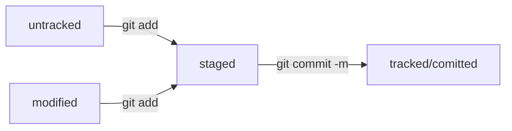

# GIT BASH, GIT, GITHUB
---
Создатель Сальников Ю.А.  
Цель: справочная информация по курсу Введение в Git  
Решаемые задачи:  
1. Создать краткую справку для быстрого освежения знаний
2. Выучить команды в процессе создания справки
3. Выучить язык MARKDOWN
Закрываемые проблемы:  
1. Пустое резюме на HH
2. Недостаток знаний для грейда
---
## GITBASH Командная строка
- **<имя команды> --help:** Справка по команде
- **pwd:** Показать текущую рабочую папку
- **cd: Перейти в другую папку
- **~:** Домашняя папка
- **.:** Текущая папка
- **..:** Родительская папка
- **/:** Разделитель папок
- **ls:** Показать список всех файлов и папок в текущей папке
- **ls -a:** Показать в том числе скрытые начинающиеся с "."
- **ls -l:** Показать списком
- **touch:** Создать файл
- **mkdir:** Создать папку
- **mkdir -p:** Создать папку и при необходимости родительские папки
- **rm:** Удалить файл
- **rmdir:** Удалить пустую папку
- **rm -r:** Удалить папку с файлами и папками рекурсивно
- **rm -rf:** Удалить папку с файлами и папками рекурсивно без сообщений
- **cp:** Копирование файлов
- **mv:** Перемещение | переименование файлов и папок
- **cat:** Чтение текстовых файлов
- **TAB:** Автозавершение ввода
- **&&:** Выполнить более одной команды
- **\\:** Продолжить команду на новой строке окна интерпретатора
## GIT
- git version: Проверка версии
- git config --global user.name <name>: Задать имя пользователя
- git config --global user.mail <mail>: Задать почту пользователя
- git config --list: Вывести настройки пользователя
- git init: Сделать текущую папку репозиторием GIT
- rm -rf .git: Удалить папку .git из текущей папки, после этого текущая папка больше не является репозиторием GIT
- git status: Проверить состояние репозитория
- git add <Имя файла>: Добавляет файл в индекс
- git add --all: Добавление (индексация) всех файлов: новых, измененных и удаленных.
- git add .: Добавление (индексация) новых и измененных файлов, без удаленных файлов. Добавления всех изменений в файлы текущего каталога и его подкаталоги.
- git add -u: Добавление (индексация) измененных и удаленных файлов, без новых файлов.
- git add -A: Добавление (индексация) всех файлов: новых, измененных и удаленных.
- git commit -m '<Сообщение>': Создать коммит с сообщением
- git log: Просмотр истории коммитов
## GITHUB
- https://github.com/username: Профиль на GitHub
- По умолчанию директория с SSH-ключами находится в домашней директории пользователя
- ls -la .ssh/: Вывести список созданных ключей
- ssh-keygen -t ed25519 -C "электронная почта, к которой привязан ваш аккаунт на GitHub": Генерация SSH ключа по алгоритму ed25519
- После генерации SSH ключа будет создана два файла - приватный закрытый ключ и открытый ключ с расширением .pub
- clip < ~/.ssh/id_ed25519.pub: Копирование содержимого публичного ключа id_ed25519.pub в буфер обмена, далее можно вставить в настройках на сайте github.com
- cat ~/.ssh/id_ed25519.pub: Вывести содержимое публичного ключа в консоль и скопировать вручную, далее можно вставить в настройках на сайте github.com
- git remote add: Привязать локальный репозиторий к удалённому
- git remote add origin <URL>: URL - скопировать с удалённого репозитория на сайте github.com
- git push -u origin main: Первая синхронизация локального с удалённым репозиторием, origin имя удалённого репозитория, main - ветка удалённого репозитория
## GIT ADVANCED
HEAD - это файл в папке .git репозитория 
HEAD создержит относительную ссылку на файл с хешем последнего коммита 
Каждый коммит идентифицируется хешем по алгоритму SHA-1 
Команда git log --oneline выводит историю коммитов по одному коммиту в строку 

Все файлы репозитория делятся на untracked и tracked 
untracked - добавленные новые файлы, которые ещё не были ни в одном коммите и не включены в индекс 
tracked - это файлы, которые уже присутствовали хотя бы в одном коммите или включены в индекс 
Если файл не был ни в одном из коммитов, то он может быть untracked, tracked staged, tracked staged modified 
Если файл был в в одном из предыдущих коммитов, то он может быть tracked, tracked staged, tracked staged modified 

Примечание коммита должно быть коротким и информативным 
Для русскоязычных примечаний использовать инфинитив, для англоязычных императив 
В зависимости от ситуации ссылаться на номер задачи или проблемы.

